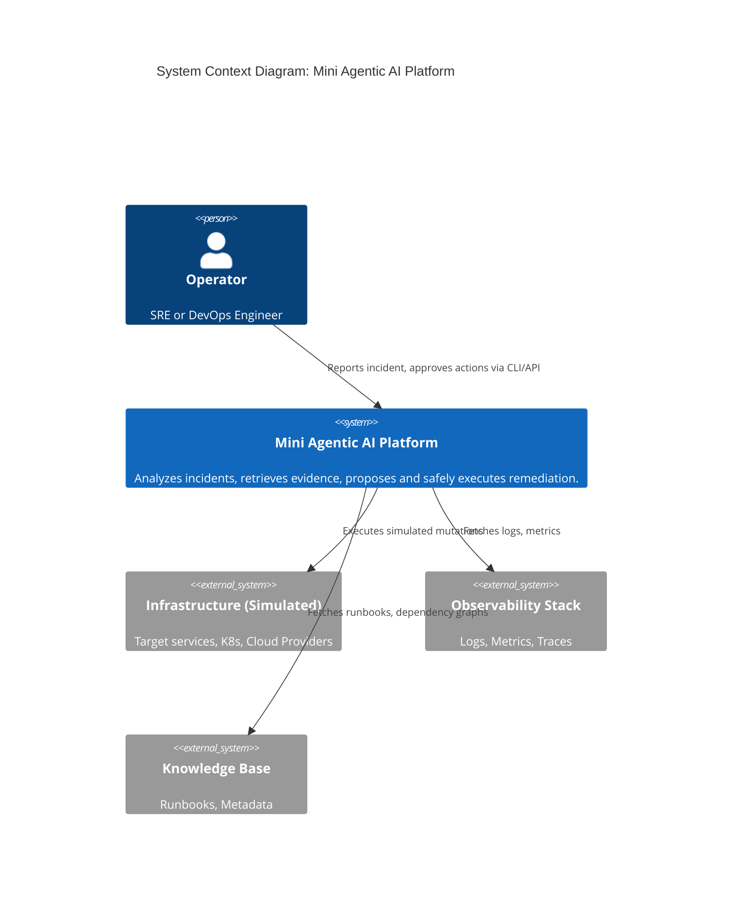

# 01 - System Architecture

## Context, Goals, Non-goals, Constraints, and Quality Attributes

**Context**
An engineering team requires an AI-assisted capability to analyze and remediate production incidents safely. Operational remediation carries high risk, necessitating that any probabilistic reasoning (LLM logic) be strictly contained within deterministic safety boundaries, human approval gates, and rigorous audit trails.

**Goals**
*   Build a secure, state-managed Mini Agentic AI Platform capable of safely analyzing incidents and proposing remediations.
*   Enforce deterministic policy checks on all proposed actions before they reach the tool gateway.
*   Maintain a strict audit log and trace of every decision, step, and rejection for replay and analysis.
*   Utilize typed A2A (Agent-to-Agent) messaging for communication.

**Non-goals**
*   Open-ended, conversational multi-agent chat without rigid state boundaries.
*   Direct, unverified execution of infrastructure changes without policy or human gating.
*   Building a comprehensive web UI (a robust CLI and minimal HTTP API are sufficient).
*   Reliance on heavy, paid SaaS platforms for the core path (e.g., managed vector DBs or remote orchestration engines).

**Constraints**
*   3–4 working days timebox for a functional prototype.
*   All infrastructure actions must be simulations.
*   Local deployment (Docker Compose or standard environment) as the default.

**Quality Attributes**
*   **Auditability**: Every material action must be logged and replayable.
*   **Determinism**: Workflow state transitions and policy gates must be completely deterministic.
*   **Safety**: Blast radius must be limited by knowledge graph analysis.
*   **Idempotency**: All executing tools and remediation commands must be idempotent.

---

## System Context and Container Diagrams



```mermaid
C4Container
    title Container Diagram: Platform Internals
    
    Container_Boundary(core, "AgentOps Platform") {
        Container(cli, "CLI / API", "Typer / FastAPI", "Operator Interface")
        Container(orchestrator, "Orchestrator", "LangGraph / Python", "State machine & workflow engine")
        
        Container_Boundary(agents, "Agent Layer") {
            Container(planner, "Planner Agent", "LLM + Prompts", "Parses intent, plans tasks")
            Container(investigator, "Investigator Agent", "LLM + Hybrid Search", "Gathers evidence")
            Container(io_agent, "I&O Agent", "LLM", "Proposes infrastructure tools")
            Container(verifier, "Safety Verifier", "Deterministic Rules", "Approves/Denies based on policy")
        }
        
        Container(tool_gateway, "Tool Gateway", "Python MCP Server", "Safely routes and executes simulated tools")
        
        ContainerDb(db, "Persistence & Audit", "SQLite / FTS5", "Stores traces, events, state")
        ContainerDb(vector_db, "Semantic Search", "Local Qdrant", "Stores vector embeddings")
        ContainerDb(kg, "Knowledge Graph", "NetworkX JSON", "Service dependencies")
    }
    
    Rel(cli, orchestrator, "Triggers Workflow")
    Rel(orchestrator, agents, "Delegates via Typed A2A")
    Rel(orchestrator, db, "Checkpoints state & traces")
    Rel(agents, tool_gateway, "Propose Actions")
    Rel(investigator, vector_db, "Searches Semantics")
    Rel(investigator, db, "Searches Lexical (BM25)")
    Rel(verifier, kg, "Calculates Blast Radius")
```

---

## Control Flow versus Data Flow

**Control Flow**: Strictly owned by the Orchestrator (implemented via LangGraph). The Orchestrator dictates state transitions (e.g., `PLANNING` -> `INVESTIGATING` -> `PROPOSING_REMEDIATION`). Agents cannot unilaterally change workflow state; they only return output back to the Orchestrator.
**Data Flow**: Data flows entirely through typed Pydantic payloads (A2A envelopes). Agents consume input states and generate typed outputs (e.g., `EvidenceBundle`, `RemediationProposal`). 

---

## Trust Boundaries and Security Boundaries

*   **Agent Boundary**: Agents run in a sandboxed, least-privilege mode. They never possess raw SDK credentials or execution permission. 
*   **Tool Gateway Boundary**: Tools are separated by an authorization and policy layer. The gateway enforces tenant/environment scope matching before invoking a local mock or function.
*   **LLM Boundary**: Model outputs are treated as untrusted user input until coerced into strict JSON schemas via Pydantic. Validation failures trigger short-circuit retries.

---

## Agent Responsibilities and Separation of Duties

1.  **Planner Agent**: Converts the natural language incident into a typed investigation objective. Can only select tasks from an allowlisted taxonomy.
2.  **Investigator and RAG Agent**: Responsible for evidence retrieval (logs, metrics, runbooks, dependencies). Forms a cited incident hypothesis based *only* on retrieved data. Cannot recommend actions.
3.  **Infrastructure and Operations (I&O) Agent**: Analyzes approved intents to propose a typed tool execution, specifying preconditions, rollback plans, idempotency keys, and estimated blast radius.
4.  **Verifier and Safety Agent**: Exclusively deterministic. Runs invariants, policy evaluation, scale limits, and graph-based blast radius limits. Yields `ALLOW`, `DENY`, or `REQUIRE_APPROVAL`. Never relies on an LLM for final authorization.

---

## Orchestration State Machine and Deterministic Transition Table

| Current State | Event / Trigger | Guard / Invariant | Next State |
| :--- | :--- | :--- | :--- |
| `RECEIVED` | Incident parsed | Schema valid | `VALIDATING_INPUT` |
| `VALIDATING_INPUT` | Input valid | Tenant scope matches | `PLANNING` |
| `PLANNING` | Plan generated | Taxonomy valid | `INVESTIGATING` |
| `INVESTIGATING` | Evidence gathered | Evidence sufficient | `SYNTHESIZING_EVIDENCE` |
| `SYNTHESIZING_EVIDENCE` | Hypothesis formed | Contains citations | `PROPOSING_REMEDIATION` |
| `PROPOSING_REMEDIATION`| Action proposed | Tool exists | `VERIFYING_SAFETY` |
| `VERIFYING_SAFETY` | Safety checked | Result == `DENIED` | `DENIED` |
| `VERIFYING_SAFETY` | Safety checked | Result == `REQUIRE_APPROVAL` | `WAITING_FOR_APPROVAL` |
| `VERIFYING_SAFETY` | Safety checked | Result == `ALLOW` | `EXECUTING` |
| `WAITING_FOR_APPROVAL` | Operator approves | Signature valid | `EXECUTING` |
| `EXECUTING` | Action executes | Idempotency valid | `VERIFYING_OUTCOME` |
| `VERIFYING_OUTCOME` | State verified | State == desired | `COMPLETED` |

*Failure nodes (`FAILED`, `TIMED_OUT`, `CANCELLED`) are globally reachable upon unrecoverable exceptions or retry exhaustion.*

---

## Structured A2A Message Contracts

Messages are discriminated unions ensuring strict typed interoperability:
*   `schema_version`: (e.g., `v1`)
*   `message_id`, `run_id`, `trace_id`, `correlation_id`, `causation_id`
*   `sender`, `recipient`, `tenant_id`, `environment`
*   `message_type`: (e.g., `InvestigationTask`, `RemediationProposal`, `SafetyDecision`)
*   `payload`: Pydantic object specific to the `message_type`

---

## Tool Execution Path and Policy Enforcement Points

1.  **Proposal**: I&O Agent drafts a `ToolCallProposal`.
2.  **Safety Gate (Policy Enforcement)**: Verifier intercepts proposal -> Checks tenant, environment, blast radius, allowed arguments. 
3.  **Approval Gate**: Orchestrator pauses for human intervention (if autonomy tier dictates).
4.  **Execution Gateway (Defense in Depth)**: Tool Gateway receives command, verifies approval token/signature, verifies idempotency key, executes mocked logic, logs outcome.

---

## Hybrid Retrieval and Knowledge-Graph Design

*   **Hybrid Retrieval**: SQLite FTS5 for exact keyword matching (Lexical) + Local Qdrant (Semantic). Results merged via Reciprocal Rank Fusion (RRF). Filters strictly applied *before* fusion for tenant/environment isolation.
*   **Knowledge Graph**: A lightweight NetworkX instance, hydrated from versioned JSON files. Represents nodes (Service, Owner, Dependency, Runbook) and edges. Used critically for programmatic upstream/downstream blast radius calculation.

---

## Persistence, Replay, Idempotency, and Failure Recovery

*   **Persistence**: SQLite (with SQLAlchemy) manages run states, event logs, and checkpoints. 
*   **Audit/Replay**: The event log is append-only. `Replay` reconstitutes the state from events to verify deterministic transitions or for offline audits, specifically *without* invoking the LLM.
*   **Idempotency**: All executing tools require an `idempotency_key`. The gateway checks the DB for prior executions.
*   **Failure Recovery**: Bounded retries with exponential backoff on transient errors (e.g., malformed LLM JSON). Terminal failures write structured errors to the audit trace.

---

## Observability and Evaluation Architecture

*   **Observability**: OpenTelemetry spans represent `Workflow Run` -> `Agent Span` -> `Step Span` -> `Tool Call Span`. JSON logging correlates via `trace_id`. Automatic redaction of sensitive arguments before storage.
*   **Evaluation**: Offline tests utilize Pytest and fake LLM adapters (Mock Models) generating deterministic JSON to validate invariants (e.g., ensuring a `DENY` from the safety agent strictly stops execution). 

---

## Local Deployment Topology

1.  **Application**: Pure Python backend running via `uv` / standard virtualenv.
2.  **Data Stores**: SQLite file (database & lexical search), Qdrant instance (Vector store, can run in Docker or local memory).
3.  **Interface**: Typer CLI wrapper or FastAPI endpoint running on `localhost:8000`. 
4.  **No dependencies on K8s or external managed services** for the prototype core path.
