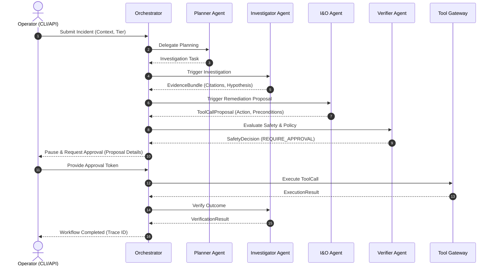
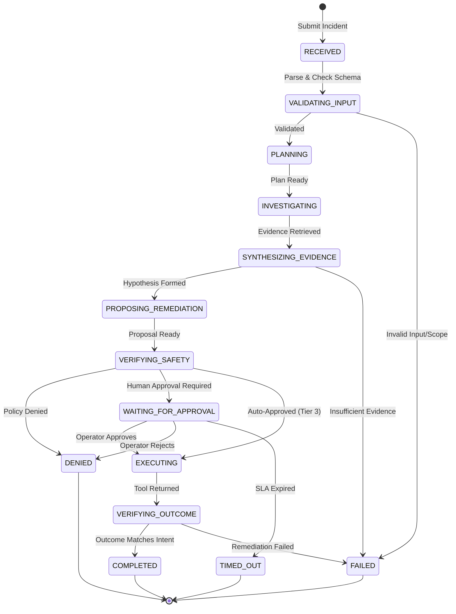

# 02 - User Flow

## Primary Operator Flow

---

## State Diagram (Incident Intake to Completion/Failure)

---

## Execution Paths

### 1. Happy Path (Tier 3 Autonomous Simulation)
1. Incident is received and mapped to known services.
2. Planner identifies the objective; Investigator finds relevant BM25/Semantic evidence proving root cause.
3. I&O Agent proposes a scale or restart action.
4. Verifier confirms the blast radius is within threshold, the tenant is isolated, and the action matches Tier 3 constraints.
5. Verifier outputs `ALLOW`.
6. Orchestrator executes directly via Tool Gateway.
7. Verification validates simulation state and marks `COMPLETED`.

### 2. Approval-Required Path (Tier 2 Simulation)
1. Workflow proceeds to `VERIFYING_SAFETY`.
2. Verifier notes that action severity requires `Tier 2` (Approval). Outputs `REQUIRE_APPROVAL`.
3. Orchestrator pauses, saving state to SQLite.
4. Operator runs `agentops run status <run-id>` and `agentops run approve <run-id> --proposal <proposal-id>`.
5. Orchestrator resumes execution.

### 3. Denied-Action Path
1. I&O Agent proposes scaling replicas to 500.
2. Verifier evaluates policy: `max_replicas_per_service = 100`.
3. Verifier outputs `DENY` with reason code `REPLICA_LIMIT_EXCEEDED`.
4. Orchestrator records rejection. Transition ends at `DENIED` terminal state. LLM does not get to argue or bypass.

### 4. Retry Path
1. I&O Agent outputs a malformed JSON without an `idempotency_key`.
2. Model Gateway validation throws Pydantic `ValidationError`.
3. Orchestrator intercepts, increments `retry_count`, and resubmits to LLM with the error attached.
4. After 3 failed attempts, state transitions to `FAILED` with `MALFORMED_OUTPUT`.

### 5. Replay Path (Audit Mode)
1. Operator wishes to understand why an action was approved yesterday.
2. Operator runs `agentops run replay <run-id> --mode audit`.
3. Platform streams the exact A2A messages and deterministic evaluations from SQLite, skipping all live LLM/Tool invocations.

---

## Interfaces

### Command Line Interface (CLI)
*   **Run Incident**: `agentops incident run --file examples/incidents/checkout-api.json`
*   **Check Status**: `agentops run status <run-id>`
*   **Approve Proposal**: `agentops run approve <run-id> --proposal <proposal-id>`
*   **Show Trace**: `agentops trace show <run-id>`
*   **Replay**: `agentops run replay <run-id> --mode audit`
*   **Run Evaluations**: `agentops eval run`

### HTTP API (FastAPI)
*   `POST /v1/incidents` - Submit new incident payload
*   `GET /v1/runs/{run_id}` - Retrieve run status and current state
*   `GET /v1/runs/{run_id}/trace` - Fetch redacted OpenTelemetry/Audit trace
*   `POST /v1/runs/{run_id}/approve` - Submit approval token
*   `POST /v1/runs/{run_id}/replay` - Trigger replay and retrieve timeline
*   `GET /health`, `GET /ready` - Standard probes
